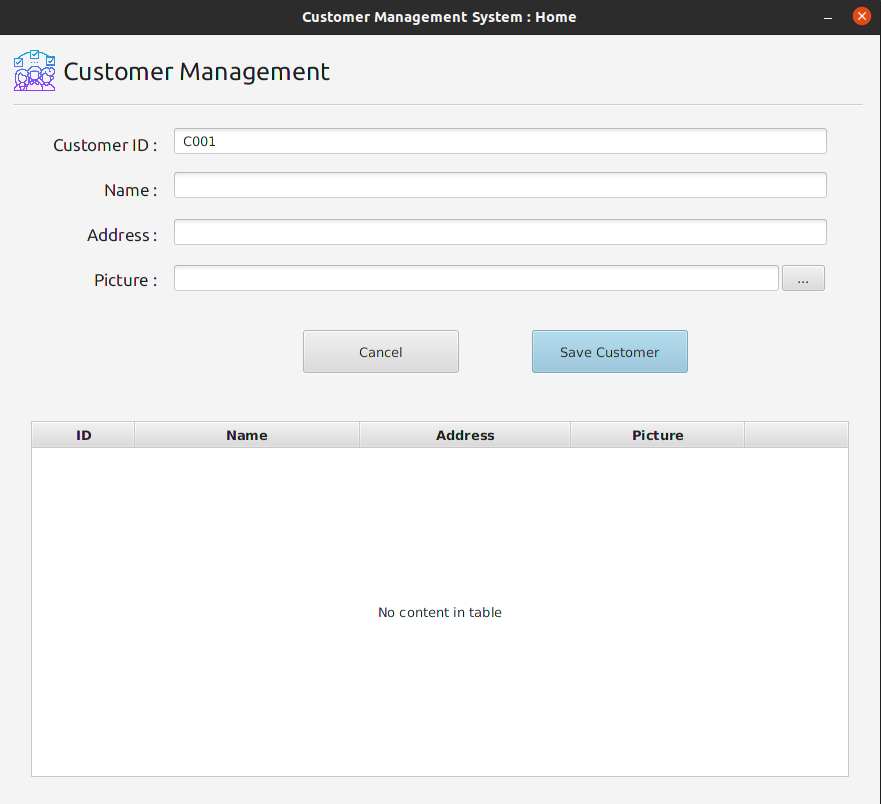

# Customer Management System - V 1.0.0

## Overview
Here I have developed a simple customer management system. This system can save customer details and update details.
I have used Java and JavaFX library to create this application. As a dependency Management tool I used Maven. I used serialization to save a backup of the data.
The source code is available to everyone under the standard [MIT License](https://choosealicense.com/licenses/mit/).

## License
Copyright © 2022 -  B G Thakshila Nuwangi. All rights reserved.

Licensed under the [MIT License](https://choosealicense.com/licenses/mit/)